
<h1 align="center">防疫信息登记系统的设计与实现</h1>

## 简介
防疫信息登记系统：角色分为管理员、用户；主要功能包括用户管理、签到管理、风险地区管理、公告管理和数据统计。界面设计简洁，支持信息录入、修改、查询和统计分析。    --计算机毕业设计源码；毕设源码；java毕业设计源码

## 联系方式

<h3 align="center">获取完整代码与数据库文件 + 微信：deepguan QQ: 86050149 QQ群: 783742310</h3>

<h3 align="center">可帮忙远程部署 包运行成功！提供远程部署、修改代码、设计文档指导、代码讲解等服务！</h3>

## 功能介绍（完整见运行截图）
管理员：管理员可以通过系统进行用户信息的管理，包括账户、姓名、手机号、身份证号和性别的录入与修改，支持照片及身份证文件的上传功能。此外，管理员能够管理签到信息、公告类型以及风险地区，通过导航栏快速访问这些模块。系统允许对风险地区进行登记与更新，配置风险等级，以及公告的新增、查看、修改和删除功能。同时，系统提供数据统计功能，如感染率图表，方便对疫情数据进行可视化管理。

用户：用户可以通过注册页面填写个人信息，如账户、密码、姓名、手机号、身份证号和性别，完成注册。注册成功后，用户可登录个人中心查看和修改个人信息，支持上传照片和身份证文件。用户还可以通过系统签到管理模块查看和操作签到信息，访问风险地区更新和公告信息。用户可在登录界面选择合适身份进行登录，确保信息安全，并使用功能简单明了的界面进行疫情信息的更新和展示。

## 运行截图
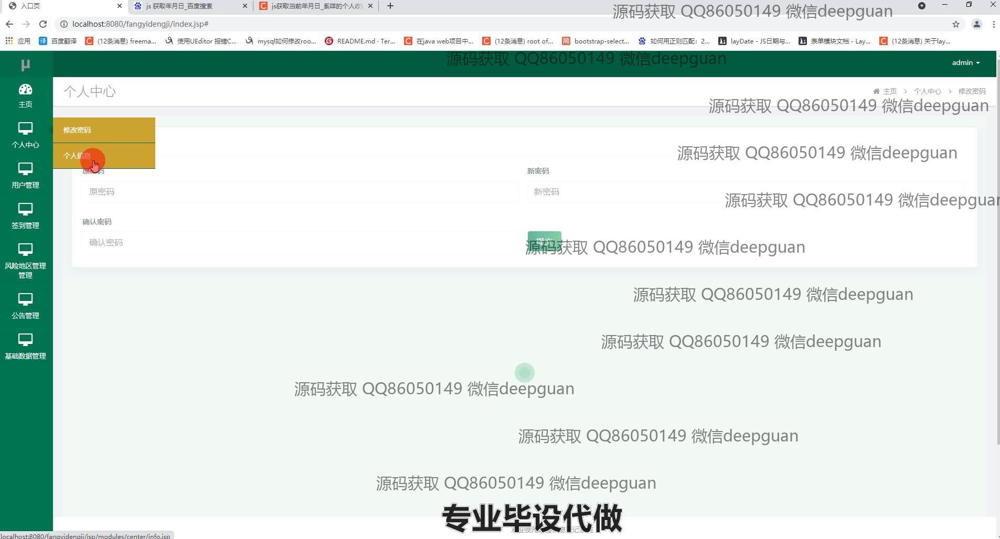
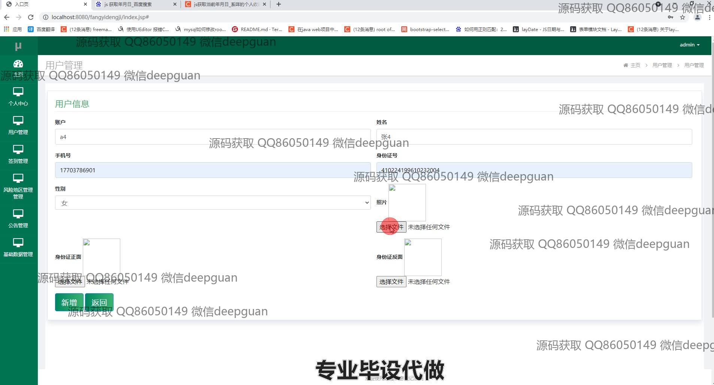
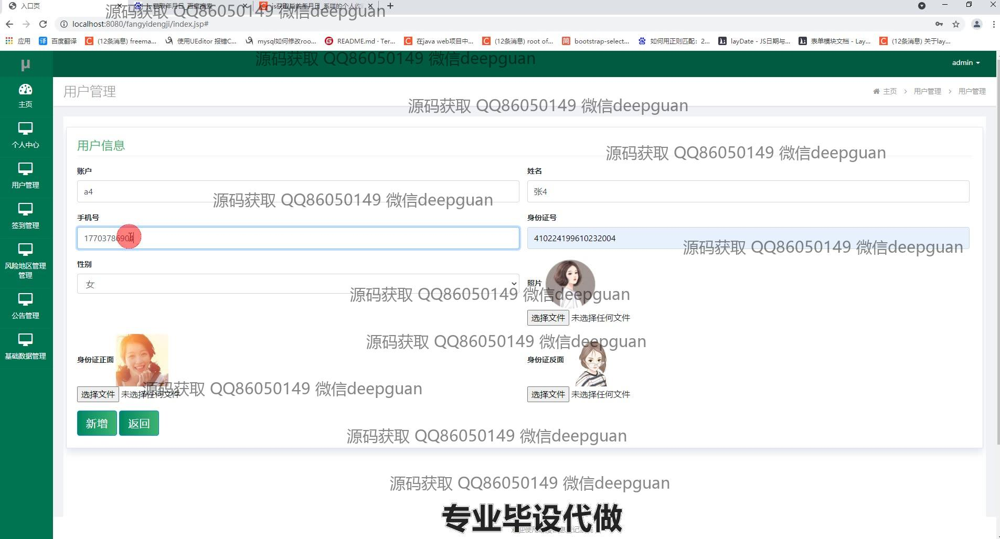
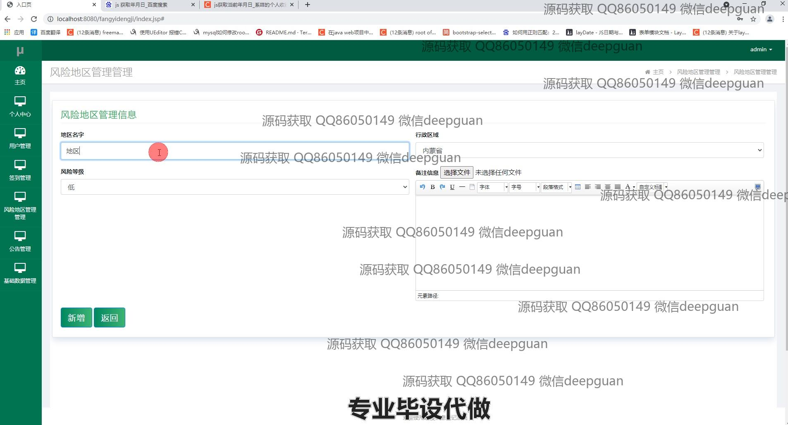
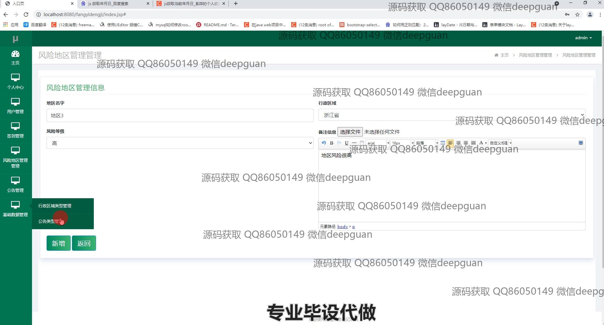
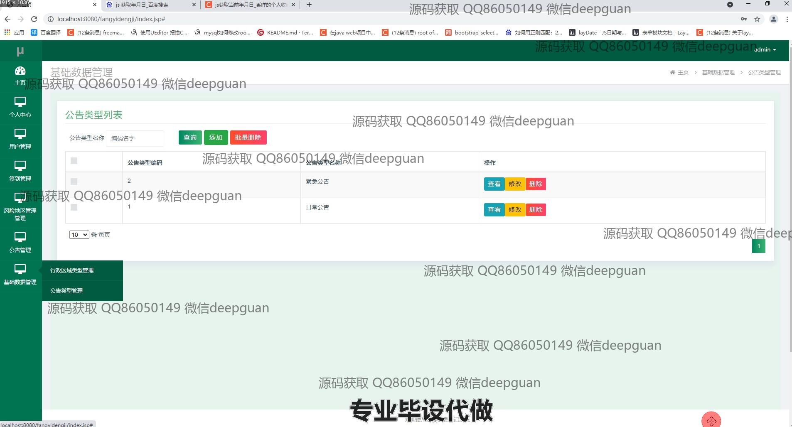
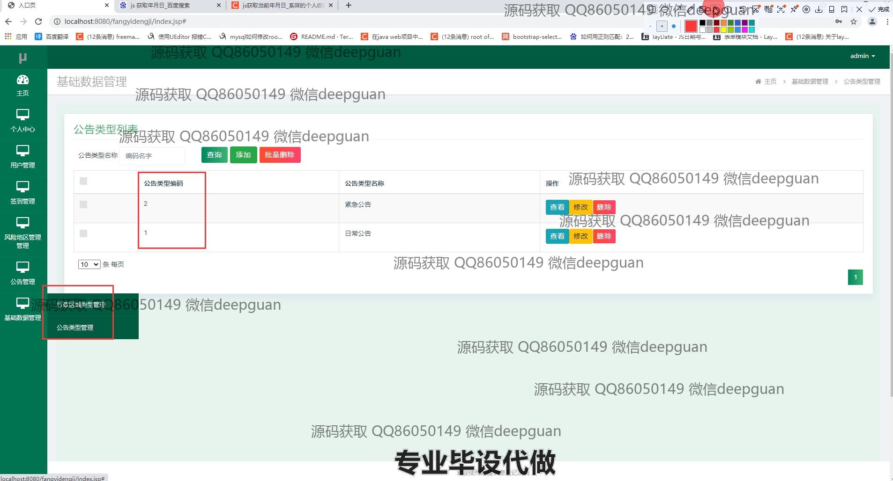
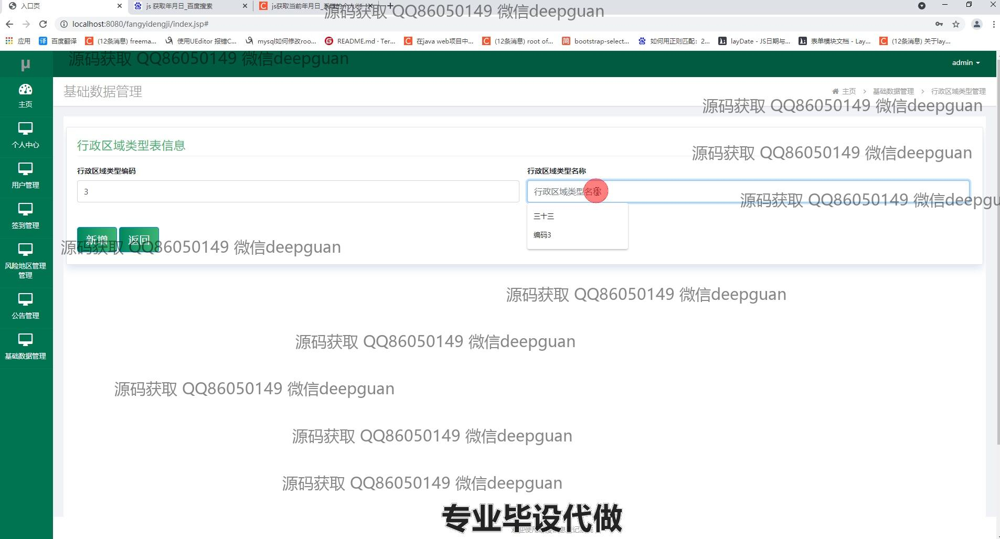
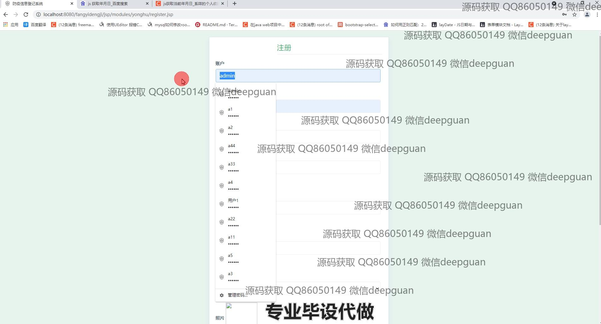
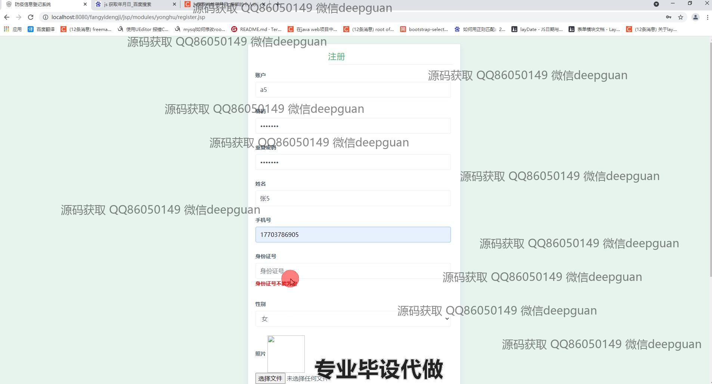
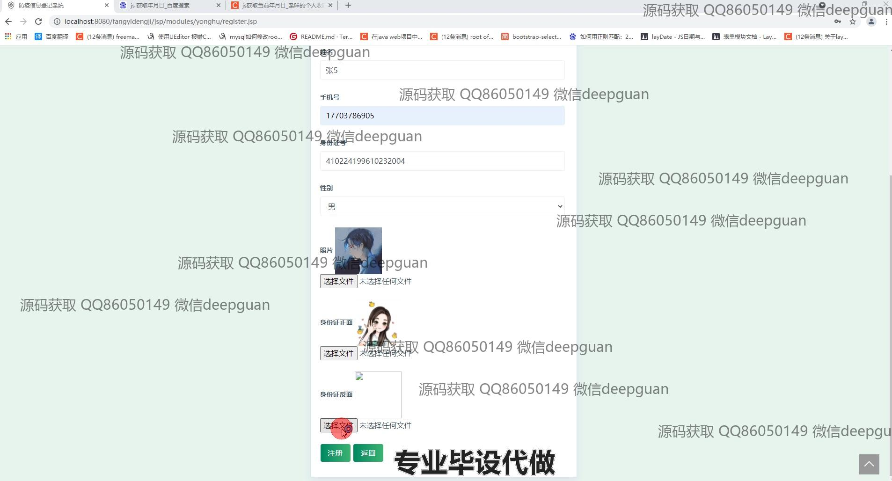
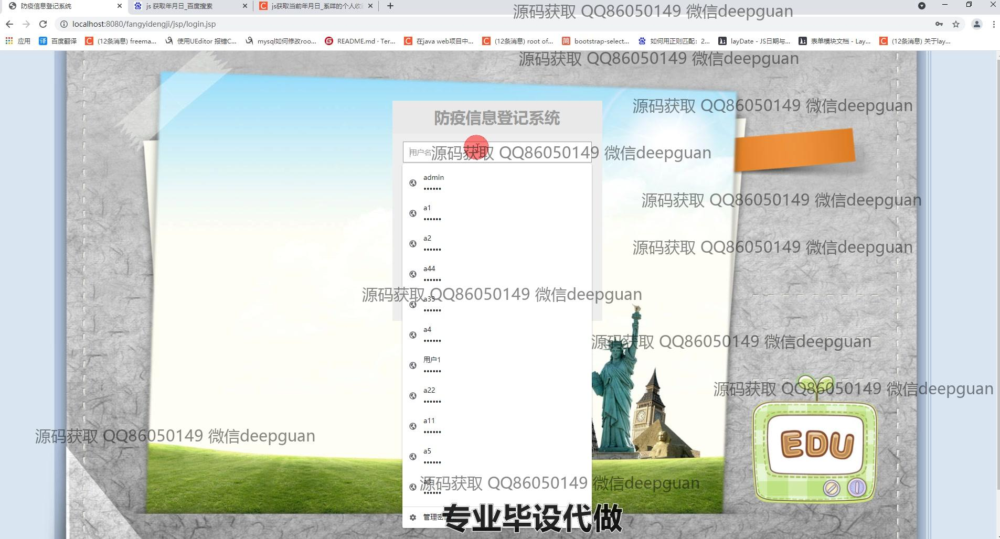
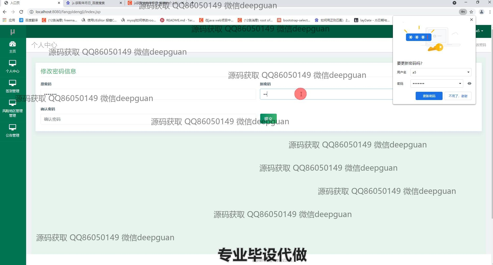
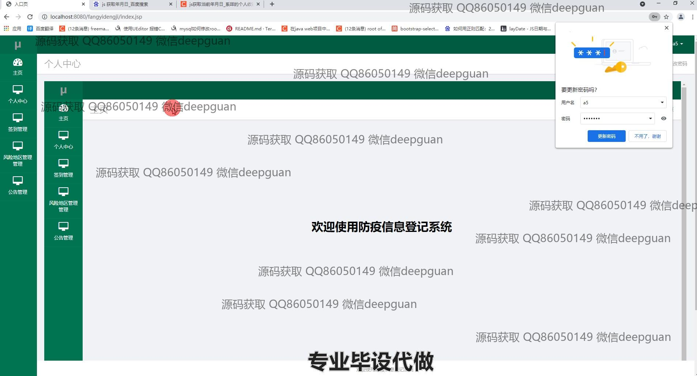
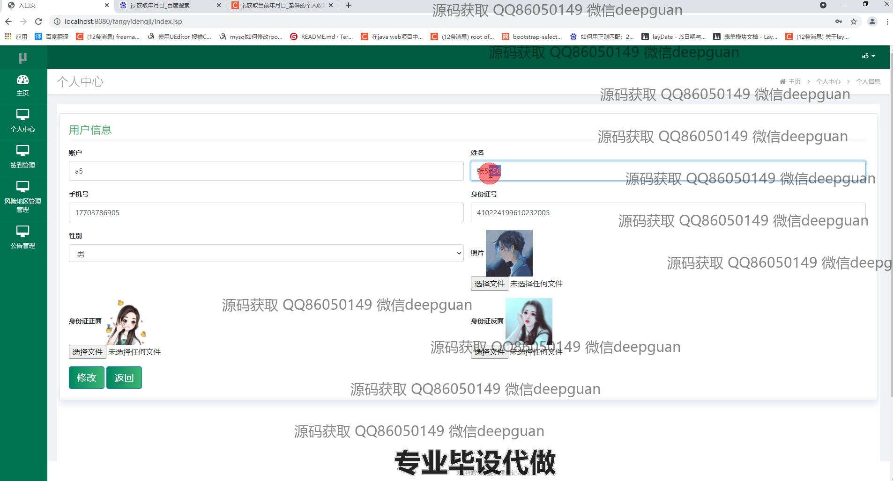

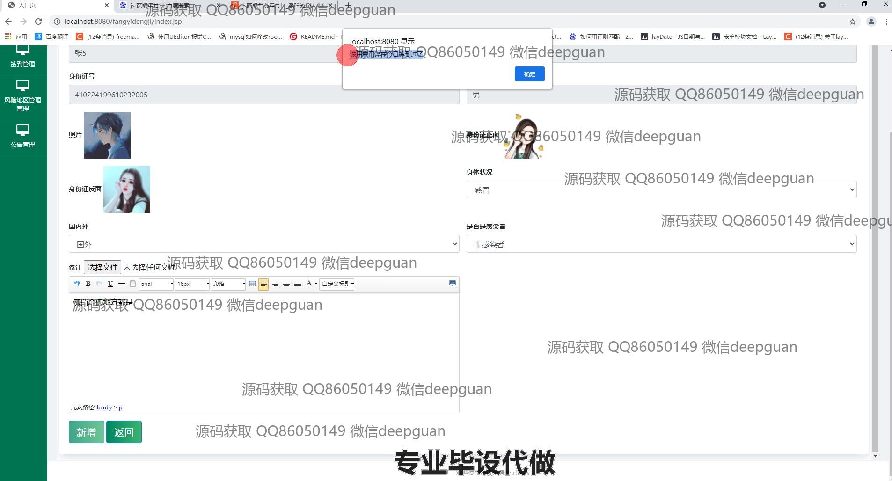
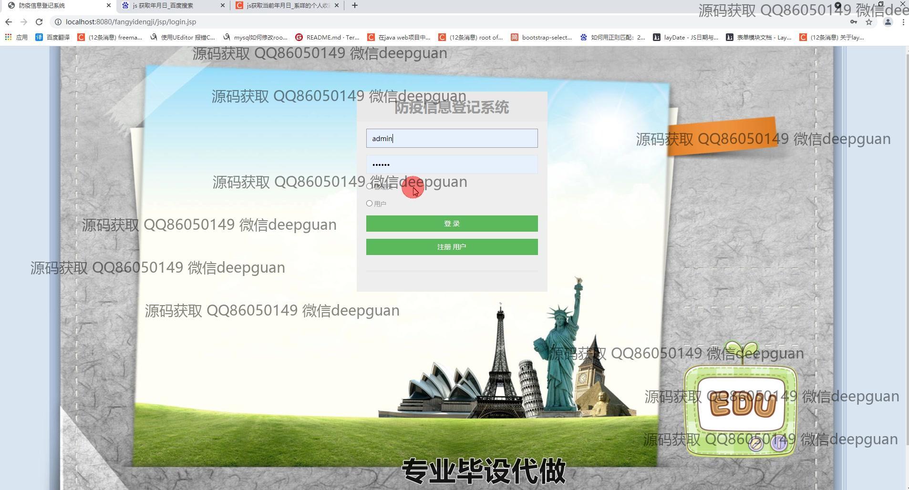
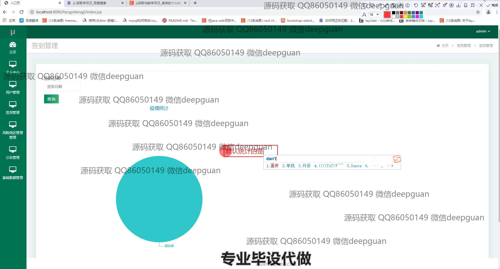
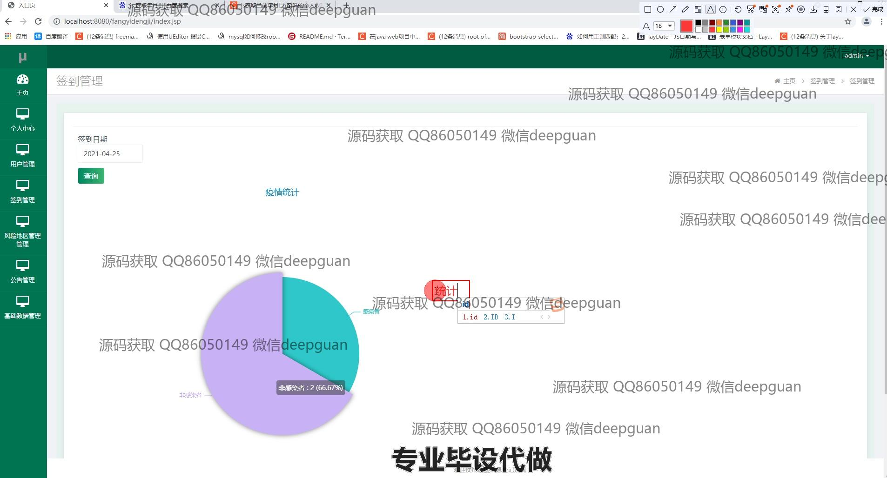

本代码来源于网络,仅供学习参考使用!

